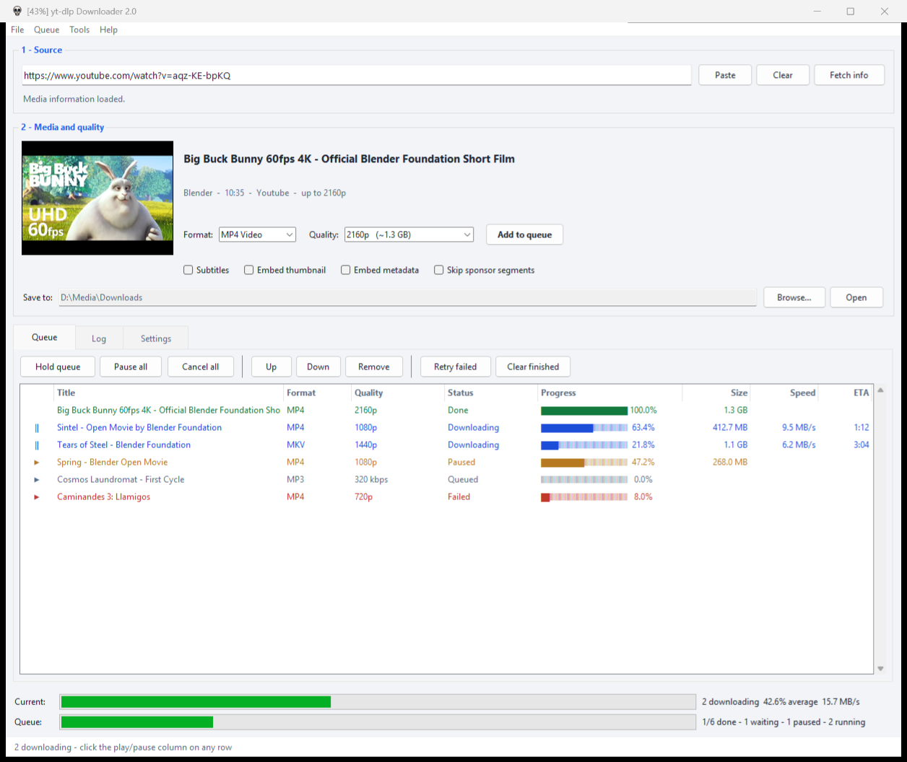
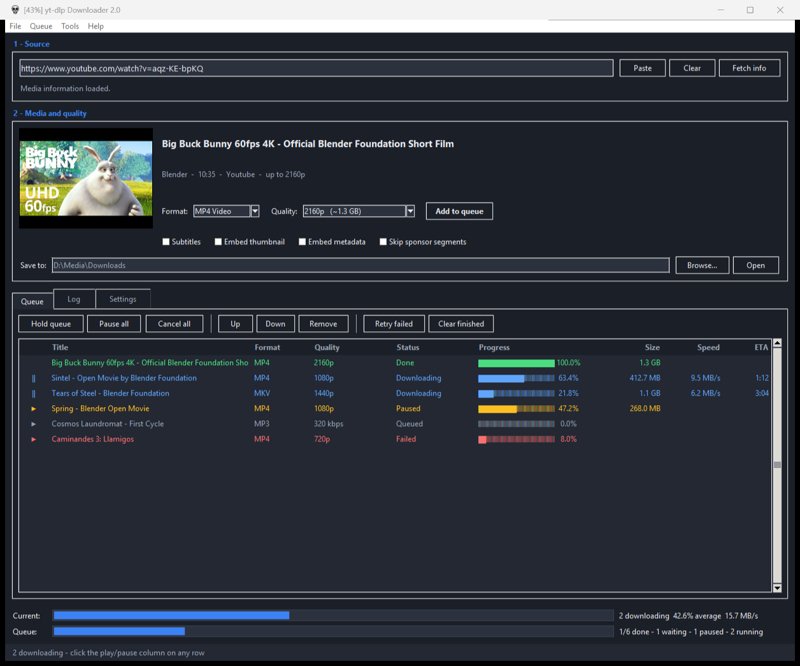

# yt-dlp Downloader

A Windows desktop front-end for [yt-dlp](https://github.com/yt-dlp/yt-dlp): paste a URL, see
what the video actually offers, pick a quality, and let a queue download everything one item
at a time. Built with tkinter, packaged as a single `.exe` with yt-dlp and ffmpeg bundled
inside — nothing to install.



<details>
<summary><b>Dark mode</b> — switchable in Settings</summary>



</details>

## What it does

**Inspect before you download.** Paste a URL and the media info is fetched automatically:
title, uploader, duration, thumbnail, and the resolutions that genuinely exist for that video
— each with an estimated file size. A 4K upload offers 2160p down to 144p; a 720p one only
offers what it has, instead of a fixed list that silently falls back.

**A queue that keeps working.** Add items while a download is running and they start
automatically, in order, as soon as the current one finishes. Reorder, remove, retry failed
items, or cancel the running download. The queue survives restarts.

**Play/pause on every row.** One download runs at a time by default, but the control in the
first column of each row overrides that: press play on a queued item to run it alongside the
current one, or pause a running one. Pausing stops yt-dlp and keeps the partial file, so
pressing play again continues from where it stopped instead of starting over. Raise
*Downloads at the same time* in Settings if you would rather several always run at once.

**Playlists and batches.** A playlist URL can be expanded into one queue entry per video, or
kept as a single entry. Paste several URLs at once, one per line, to queue them together.

**Live progress.** Per-item and whole-queue progress bars with real speed, ETA and size,
read from yt-dlp's structured progress output rather than scraped from its console text.
With several downloads at once the top bar shows their average and combined throughput. The
window title shows the current percentage, so it is readable from the taskbar.

**Formats.** MP4 / MKV / WEBM video, or MP3 / M4A / WAV / FLAC / Opus audio with a selectable
bitrate. Optional subtitles (embedded or as `.srt`), embedded thumbnails and metadata, and
SponsorBlock segment removal.

**Quality-of-life.** Light and dark themes, clipboard watching, keyboard shortcuts, a
right-click menu on the queue, filename templates, per-playlist subfolders, a speed limit, a
download archive to skip files you already have, and cookie import from your browser for
sites that need a login.

## Getting started

Run `yt-dlp-gui-2.0.exe`. There is no installer and no dependency to set up.

On first launch it copies its bundled `yt-dlp.exe` into `%LOCALAPPDATA%\yt-dlp-gui\bin` and
runs it from there. That is deliberate: it means **Tools → Update yt-dlp** can replace the
binary in place, so you can fix a broken site without rebuilding the app.

Everything the app writes lives in `%LOCALAPPDATA%\yt-dlp-gui`:

| File | Purpose |
| --- | --- |
| `config.json` | Settings and window geometry |
| `queue.json` | The queue, restored on next launch |
| `archive.txt` | Download archive (only when enabled) |
| `bin\yt-dlp.exe` | The updatable yt-dlp copy |
| `thumbs\` | Cached preview thumbnails |

## Running from source

Requires Python 3.13. The app itself uses only the standard library — tkinter, `subprocess`,
`json` — so there is nothing to `pip install` to run it.

```bash
python main.py
```

`resources/` is **not** in this repository (it holds ~190 MB of binaries). To run or build
from source, create it and add:

- `yt-dlp.exe` — from [yt-dlp releases](https://github.com/yt-dlp/yt-dlp/releases)
- `ffmpeg.exe`, `ffprobe.exe` and their `av*.dll` / `sw*.dll` companions — from any Windows
  ffmpeg build

If `resources/` is missing, the app falls back to `yt-dlp` and `ffmpeg` on your `PATH`.

## Building the .exe

```bash
pip install pyinstaller
pyinstaller main.spec --noconfirm
```

The result is `dist/yt-dlp-gui-2.0.exe`, a single file of roughly 150 MB — most of which is
the bundled ffmpeg.

The icon is generated rather than drawn by hand, so there is no binary to edit: the skull is
defined as a handful of superellipses in `tools/make_icon.py`, which rasterises it by
supersampling and writes `assets/icon.ico` (eight sizes, 16–256 px) plus `assets/icon.png`.
Adjust the shape constants and re-run it:

```bash
python tools/make_icon.py
```

## Notes

**Keep yt-dlp current.** Sites change constantly and a stale yt-dlp is the most common cause
of a download that suddenly stops working. The app shows the version and its age in
**Settings**, and warns in the log once it is over 90 days old.

**YouTube wants a JavaScript runtime.** yt-dlp has deprecated YouTube extraction without one,
and some formats may be missing until you install [Deno](https://deno.com/) and put it on
your `PATH`. The app checks at startup and warns if none is found.

**Impersonation.** Requests are sent as Chrome by default, which helps with sites that block
plain HTTP clients. If that is rejected, the download is retried once without it
automatically. It can be turned off in **Settings**.

**How pause really works.** There is no way to freeze a running download and hold the
connection open, so pause stops yt-dlp and leaves the `.part` file in place; play restarts
yt-dlp, which continues from that file. For ordinary progressive downloads this resumes to
the byte. For fragmented streams (HLS/DASH) it resumes at the last completed fragment, so a
little of the current fragment is re-fetched. A few sites issue single-use URLs and will
restart the file instead — rare, but worth knowing.
